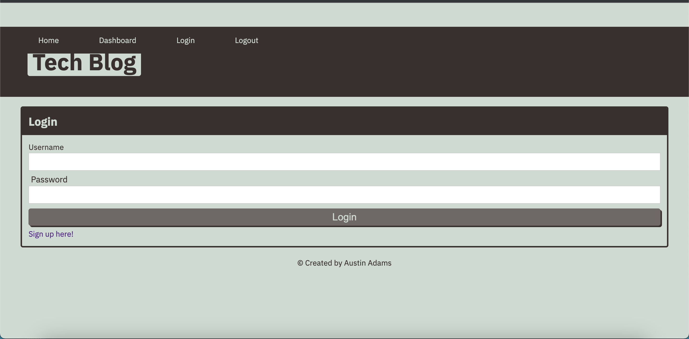
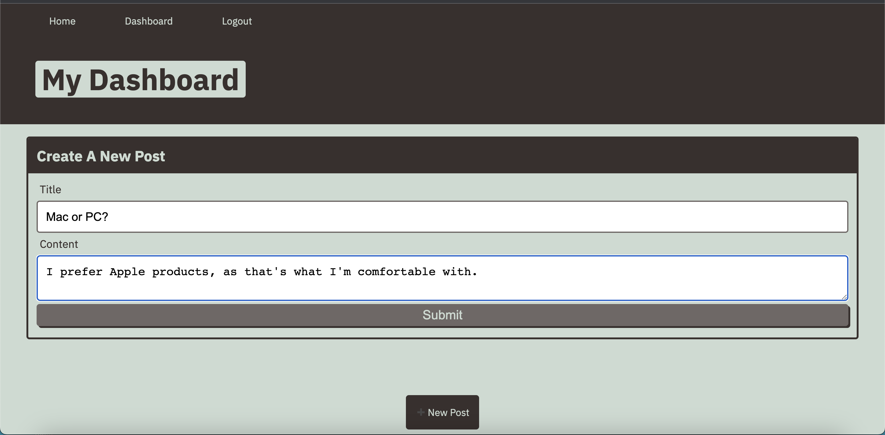

# Tech-Blog

## Description
A tech blog that users can create an account to conversate with other users in the tech world to talk about all things tech.

## Installation
- Run `npm init` and then `npm install` to install everything needed.

## Usage
To create an account, users can click on the "Login" button, located at the top nav bar. From there, they can select the "Sign up here!" button, and input a unique username and password that they'll use whenever they login next. Once logged in, users can create posts regarding anything tech related, so that they can connect with other users. Users can easily navigate around, while also easily being able to log out.

To connect to the database and connect to the server, follow these steps: 

- Start with `mysql -u root` (-p at the end if you have a password).

- Run `source db/schema.sql`

- Run `use techblog_db`, and then type "quit"

- Finally, run `npm start`

## Contributing
N/A

## Languages Used
Javascript, Sequelize, Express, Handlebars, Mysql, and CSS
## Questions?
Feel free to ask any questions you may have by reaching out to the following:

Github: https://github.com/Austin1094
Email: Austin.Adams1094@gmail.com